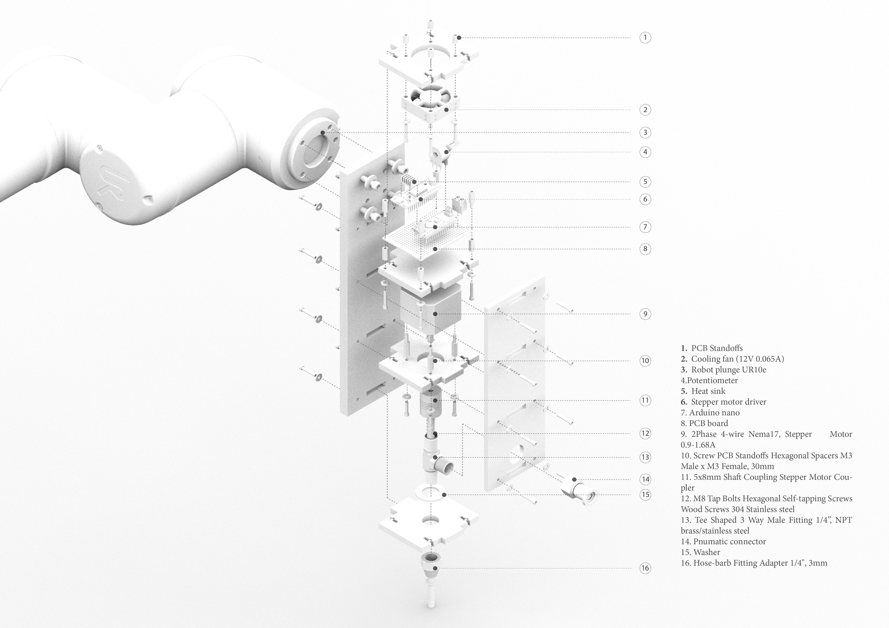

## [Clay Extruder](https://github.com/ArdooTala/Clay-Extruder.git)

#### Description
The **Clay Extruder** is meant for controlling the flow of the pumped clay for extruding using a robot.
The flow rate is controlled manually through a knob and it also includes an I/O digital input for cutting off the flow.

#### Hardware
  1. #### Body
     
  2. #### Motors and Electronics
     ###### Parts
        - Arduino (Nano or Uno)
        - Stepper (Nema 17)
        - Stepper Driver
        - Optocoupler
        - 12V Power Supply
     ###### Circuit
        

#### Software
###### References:
- [Sample text](Sample text)
- [Sample text](Sample text)

---

