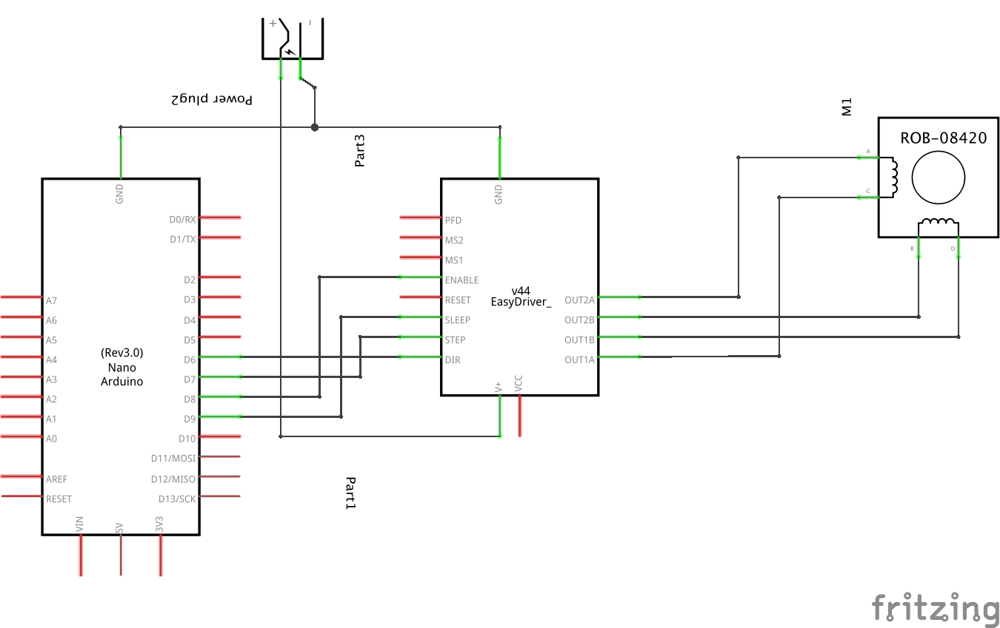

## [Arduino-Stepper-Control](https://github.com/ArdooTala/Arduino-Stepper-Control.git)

#### Description
Controlling a `stepper` through Arduino **without `delay()`**. This method enables running multiple steppers on different speeds using only one Arduino board. The code works on both `Easy-Driver` and `Pololu Drivers`.

#### Hardware
- Stepper motor
- Arduino board
- Stepper driver
- 12V Power supply

#### Wiring

###### References:
- [Easy Driver Hook-up on Sparkfun.com](https://learn.sparkfun.com/tutorials/easy-driver-hook-up-guide/all)
- [Steppers on Sparkfun.com](https://www.sparkfun.com/tutorials/400)

---

